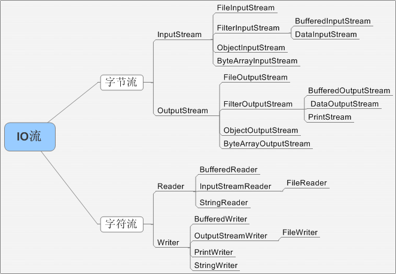
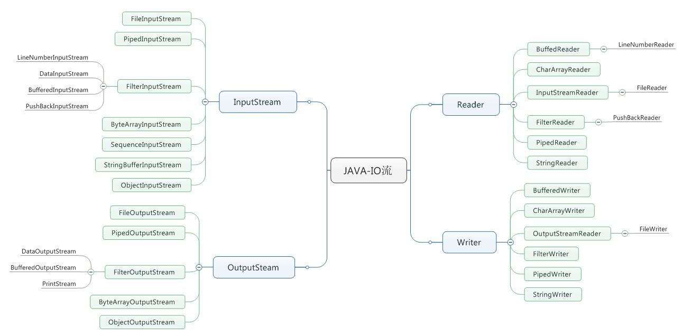

# java 基础 jdk8包
## applet
## awt
## io

### JAVA提供了几种流
字符流和字节流。字节流继承自InputStream和OutputStream，字符流继承自InputStreamReader和OutputStreamWriter

### io包中的常见接口
AutoClosable: 提供try-with-resources方式中自动关闭资源的能力
Closable：提供关闭资源的能力
Flushable: 提供将缓冲中的数据写到底层流中的能力

### 字节流和字符流的区别
* https://www.cnblogs.com/absfree/p/5415092.html
字节流：处理的基本单位是单个字节，通常用来处理二进制数据
字符流：处理的基本单位是Unicode码元（Java使用UTF-16，因此char为两个字节），通常用来处理文本数据，范围是0x0000~0xFFFF
区别：
1. 处理单位
2. 缓冲区 字节流默认不使用缓冲区，字符流使用缓冲区（缓冲编码）
3. 字节流常用处理二进制数据，实际上可以处理任意类型数据，但不支持直接写入或读取二进制码元；字符流常用与处理文本数据，它支持写入及读取Unicode码元

### 什么是Java序列化，如何实现序列化
* https://www.cnblogs.com/lanqingzhou/p/13609317.html
序列化定义：可以将一个对象的状态写入二进制流中，并且可以从其他地方将二进制流读取并重新构造一个相同对象。这种机制允许你能够将对象通过网络传播，并可以随时将对象持久化到数据库，文件中。Java序列化机制是RMI,EJB等的技术基础
序列化实现：被序列化的类需要实现Serializable接口，然后使用输出流来构造一个ObjectOutputStream对象，然后通过writeObject来将对象写出
特点：
1. 如果某个类可以被序列化，其子类也可以被序列化；如果其父类也实现了序列化，父类相关字段及属性处理与该类相同；否则，该父类所有字段不会被串行化；另外，如果父类没有实现序列化接口，则应当具有默认构造函数，否则编译报错，如果实现了序列化接口，则构造对象的时候直接从流中获取数据构造对象实例，不通过构造函数来进行
2. static和transient类型的成员不能被序列化
3. 相关的类和借口ObjectOuput,ObjectOuputStream类，ObjectInput,ObjectInputStream类
4. writeObject和readObject 本身就是线程安全的，传输过程不允许并发访问

### InputSream 的read()为什么返回int，而不是byte
* https://blog.csdn.net/weixin_44495162/article/details/1034341306
能够避免将字节读取为负数

### 如何实现对象克隆

### 其他问题
* https://www.cnblogs.com/lanqingzhou/p/13609317.html
 
## lang.annotation 
### 什么是注解，什么是元注解，有那些元注解,分别有什么作用
* https://blog.csdn.net/qq_45512238/article/details/111500806
注解是Java提供的一种绑定元数据到源代码中的方式
元注解是注解的注解，它们用来对其他注解进行说明，

1.@Target 修饰对象的范围 可以注解的目标一共10种包括TYPE(类和接口)，FIELD,METHOD,PARAMETER,CONSTRUCTOR,LOCAL_VARABLE,ANNOTATION_TYPE,PACKAGE,TYPE_PARAMTER,TYPE_USE
2.@Rentention 定义被保留的时间长短,RententionPolicy有三种SOURCE,CLASS,RUNTIME
3.@Doucumented 描述Javadoc
4.@Inherited 描述了某个被标注的类型被继承的

### 注解的继承性
* https://www.jianshu.com/p/a848655d478e
1. 基于@Inherited
2. 基于类继承 属性和方法注解的继承，与类注解完全不同，与@Inherited毫无关系，按照方法和属性本身的继承，只要子类没有重写父类方法，就会继承父类的对应注解
3. 基于接口的继承和实现 除了默认方法外，接口的方法必须被重写，所以无法继承到父接口的注解。

### 什么是重复注解
* https://blog.csdn.net/qq_37939251/article/details/83215703

### 注解是否可扩展
不行，所有的注解都是java.lang.annotation.Annotation的子类

## lang.instrument
和JMX有关

## lang.invoke
方法调用相关

## lang.management 
JMX相关，java MXBean啥的

## lang.ref
常见的几种引用，jvm里会问到的四种引用：
PhantomReference,SoftReference,WeakReference

## lang.reflect
反射相关，提供访问对类的注解，类型，构造方法，方法，参数，属性等的访问

## lang

8种基本类型的包装类型及其相关类型：Byte,Charactrer,Short,Integer,Long,Float,Double,Boolean
Void 类型
String及相关类型：StringBuilder,StringBuffer等
Class及相关类型:ClassLoader
重要接口:Clonable,Runnable
重要注解:@Deprecated,@Override
常用类:Math,Thread,System
常见错误:StackOverflowError，Throwable,Error,Enum

## math
大数相关:BigDecimal,BigInteger等

## net 网络相关
IP对象：Inet4Address,Inet6Address,IntAddress
URI/URL:URI,URL,URLConnection,HTTPURLConnection
套接字：Socket,ServerSocket,SocketAddress

## nio.channels
缓冲对象:ByteBuffer(都可以用),CharBuffer,ShortBuffer,IntBuffer,LongBuffer,FloatBuffer,DoubleBuffer,Direct(\*)Buffer,Heap(\*)Buffer
通道:Channel,
选择器:Selector

## nio.charset
字符编码相关

## nio.file
文件访问相关
Files/Paths

## rmi

## security

## sql 数据库访问相关jdbc
驱动:Driver,DriverManager
连接:Connection
语句:Statement
结果集:ResultSet

## text

## time 时间相关
LocalDate,LocalDateTime,LocalTime
Month,Year
formmater:DatetimeFormmatter

## util.cocurrent 并发包juc
### util.cocurrent.atomic 原子类
### util.cocurrent.locks 锁
AQS：抽象队列同步器，提供基于先入先出队列的阻塞锁及相关的同步器实现
Conditon:条件锁
Lock:锁
ReadWriteLock:读写锁
ReentrantLock:可重入锁

### util.cocurrent 
AES:提供ExecutorService的默认方法实现，可以将Runnable和Callable都封装成为FutureTask返回
阻塞队列:ArrayBlockingQueue,
同步容器:ConcurrentHashMap
并发容器:CopyOnWriteArrayList
线程池创建：Executors,ThreadPoolExecutor

###  util.function 函数编程相关
Consumer
BiFunction

### util.jar 

### util.logging 日志相关

### util.prefs

### util.regex 正则相关
Matcher,Pattern

### util.spi 服务扩展日期，货币，本地化，时区等扩展

### util.stream 流
Streams,Collectors

### util.zip 压缩

## util
集合相关: Colletions,ArrayList,LinkedList,HashMap,TreeMap
日期:Date,
货币:Currency
字典:Dictionary
本地化:Locale
事件模型:EventListener,EvnetObject
观察者模型:Observer,Observable
格式化:Formatter
Optional
时间循环：Timer,TimerTask

## 集合相关常问面试题
### HashMap并发情况下为什么会出现环