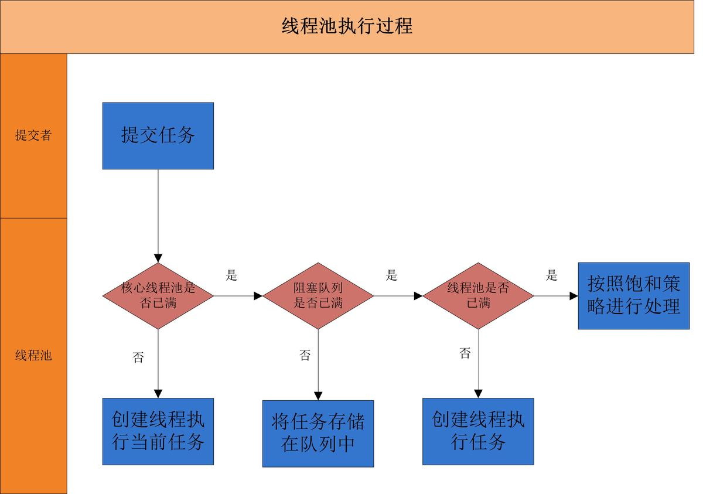

# 并发编程
## 常问面试题
### 1. ThreadPoolExecutor实现原理
https://www.jianshu.com/p/125ccf0046f3
1. 为什么要使用线程池
a.降低资源消耗;b.提升系统响应速度;c.提高线程的可管理性
2. 线程池的工作原理

3. 线程池的创建
```
ThreadExecutor( int corePoolSize,
                int maximumPoolSize,
                long keepAliveTime,
                TimeUnit unit,
                BlockingQueue<Runnable> workQueue,
                ThreadFactory threadFactory,
                RejectetExecutionHandler handler)
```

4. 线程池的关闭
shutdownNow:首先将线程池设置为STOP，然后尝试停止所有的正在执行和未执行的任务的线程，并且返回等待执行任务的列表
shutdown:将线程池的状态设置为SHUTDOWN,然后中断所有没有正在执行任务的线程

5.如何合理配置线程池参数
a. 根据任务性质：CPU密集型 Ncpu+1；IO密集型 2*Ncpu；混合性任务 拆分为CPU密集型和IO密集型
b.任务优先级；使用优先级队列PriorityBlockingQueue来处理
c.任务执行时间：优先级根据执行时间进行确定
d.任务的依赖性：依赖资源等待时间越长线程数应当更大

阻塞队列最好使用有界队列，能够控制内存资源的占用

### 2. JUC包里有哪些常用锁
https://www.cnblogs.com/doit8791/p/9131148.html

AQS,Lock,ReadWirteLock,Condition,ReetrantLock

### 3.线程同步的几种方法
1.synchronized + wait(),notify()
2.volatile
3.ReentrantLock+ await(),signal()

### 4.公平锁和非公平锁

### 5.synchronized 对象锁和方法锁的区别
https://www.cnblogs.com/shoshana-kong/p/10551952.html

### 6.synchronized 和ReentrantLock的区别
https://zhuanlan.zhihu.com/p/126085068
1.底层实现
2.是否需要手动释放
3.是否可中断
4.是否公平锁
5.是否可绑定Condition
6.锁的对象

### 7.AQS锁原理


### 8.线程状态
https://www.cnblogs.com/cowboys/p/9315331.html


### 9.阻塞和等待的区别
https://blog.csdn.net/woshiyigeliangliang/article/details/81116872
1.阻塞BLOCKING是Lock和synchronized产生的状态，被临界区的锁阻塞
2.等待WAITING是已经拿到临界区的锁之后调用wait(),join(),park()等方法产生的状态

### 10.wait和sleep的区别
https://blog.csdn.net/kangkanglou/article/details/82221301

1.sleep

### 11.CountDownLatch的用法和实现

### 12.ReentrantLock的实现


### 13.产生死锁的原因的必要条件
https://blog.csdn.net/hd12370/article/details/82814348
* 必要条件
1.互斥条件
2.请求和保持条件
3.不剥夺条件
4.循环等待条件
* 解决死锁的办法
1. 一次性分配所有资源 （破坏请求条件）
2. 只有一个资源无法获取，则不分配给其他资源（破坏保持条件）
3. 当获得部分资源，无法获取其他资源时，释放所有资源（破坏不剥夺条件）
4. 每个资源赋予编号，按照编号升序分配资源与释放（解决循环等待问题）


# 并发编程的艺术
## 1 并发编程的挑战
##### 1.1.3 如何减少上下文切换
* 无锁并发编程
* CAS算法
* 使用最少线程
* 协程

#### 1.2 死锁
* 避免一个线程同时获取多个锁
* 避免一个线程同时占用多个资源，尽量保证每个锁只占用一个资源
* 尝试使用定时锁，使用lock.tryLock来代替内部锁机制
* 对于数据库锁，加锁和解锁必须在一个数据库连接里，否则会出现解锁失败的情况


## 2 Java并发机制的底层实现原理

### 2.1 volatile的应用
1.volatile 的定义与实现原理
* 实现原理:1.Lock前缀指令会引起处理器缓存回写到内存;2.一个处理器的缓存回写到内存会导致其他处理器缓存无效

2.volatile 的使用优化
追加字节
不应该追加字节的情况:1.缓存行非64字节；2.共享变量不会被频繁的读写

### 2.2 synchronized 实现原理与应用

#### 2.2.1 Java对象头
|长度|内容|说明|
|---|---|---|
|32/64bit|Mark Word|存储对象的hashCode或锁信息|
|32/64bit|Class Metadata Address|存储对象类型数据的指针|
|32/64bit|Array length| 数组的长度|

32位的MarkWord的默认存储结构
|锁状态|25bit|4bit|1bit是否偏向锁|2bit锁标志位|
|----|----|----|------|---|
|无锁状态|对象的hashCode|对象分代年龄|0|01|

#### 2.2.2 锁的升级与对比
1.偏向锁
当一个线程访问同步代码块并获取锁的时候，会在对象头和栈帧中的锁记录里存储偏向锁的线程ID
(1)偏向锁的撤销
(2)关闭偏向锁
偏向锁延迟参数-XX:BiasedLockingStartupDelay=0
偏向锁开关参数-XX:-UsingBiasedLocking=false

2.轻量级锁
(1)轻量级加锁:创建锁记录，并将对象头中的MarkWord复制到锁记录中，然后线程尝试CAS将对象头中的MarkWord替换为指向锁记录的指针
(2)轻量级解锁:CAS将DisplacedMarkWord替换回对象头；成功则表示无竞争发生，否则膨胀成重量级锁

3.锁的优缺点对比
|锁|优点|缺点|适用场景|
|--|---|---|-------|
|偏向锁|加锁解锁不需要额外的消耗，和执行非同步方法仅存在纳秒级的差距|如果线程间存在锁竞争会带来额外撤销锁的消耗|使用于只有一个线程访问同步块的场景|
|轻量级锁|竞争的线程不会阻塞，提高了程序的响应速度|如果始终得不到锁竞争的线程，自旋会消耗CPU|追求响应时间，同步快执行非常快|
|重量级锁|线程竞争不使用自旋，不会消耗CPU|线程阻塞，响应时间慢|追求吞吐量，同步块执行时间较长|

### 2.3 原子操作的实现原理
1. 术语定义
2. 处理器如何实现原子操作

(1)总线锁定(2)缓存锁定?
有两种情况下处理器不会使用缓存锁定
a. 操作的数据不能被缓存在处理器内部，或者跨越多个缓存行
b. 有些处理器不支持缓存锁定

3. Java如何实现原子操作
(1)使用循环CAS实现原子操作
(2)CAS操作的三大问题:ABA，循环时间长开销大，只能保证一个共享变量的原子操作
(3)使用锁机制来实现原子操作

## 3 Java内存模型
### 3.1 Java内存模型的基础
#### 3.1.1 并发编程模型的两个关键问题

#### 3.1.2 Java内存的抽象结构

#### 3.1.3 从源代码到指令序列的重排序
1)编译器优化的重排序
2)指令级并行的重排序
3)内存系统的重排序

#### 3.1.4 并发编程模型的分类

## 4 Java并发编程基础
### 4.1 线程简介
#### 4.1.1 什么是线程
#### 4.1.2 为什么要使用多线程
#### 4.1.3 线程优先级
#### 4.1.4 线程的状态
#### 4.1.5 Daemon线程

### 4.2 启动和终止线程


## 5 Java中的锁
### 5.1 Lock接口
提供了锁获取与释放的可操作性，可中断的获取锁以及超时获取等多种synchronized所不具备的同步特性

### 5.2 队列同步器AQS
#### 5.2.1 队列同步器的接口与示例

#### 5.2.2 队列同步器的实现分析
1.同步队列

2.独占式同步状态获取与释放

3.共享式同步状态获取与释放

4.独占式超时获取同步状态

5.自定义同步组件TwinsLock

### 5.3 重入锁ReetrantLock

1. 实现重进入：1）线程再次获取锁；2）锁的最终释放

2. 公平与非公平锁的区别

### 5.4 读写锁
#### 5.4.1 读写锁的接口与示例
#### 5.4.2 读写锁的实现分析
1. 读写状态的设计
高16位表示读，低16位表示写
2. 写锁的获取和释放
```
...
int c = getState();
int w = execlusiveCount(c);
if(c!=0){
    if(w==0||current != getExeclusiveOwnerThread()){

    }
}
...
```
3. 读锁的获取和释放

4. 锁降级
锁降级的目的：阻拦其他线程T在在释放写锁后，立刻获取写锁并修改数据，这时，当前线程无法感知到数据更新

### 5.5 LockSupport工具

### 5.6 Condition接口
#### 5.6.1 Condition接口与示例

#### 5.6.2 Condition的实现分析
1. 等待队列
2. 等待
3. 通知


## 6 Java并发容器和框架
### 6.1 CocurrentHashMap的实现原理与应用
#### 6.1.1 为什么要使用CocurrentHashMap
#### 6.1.2 ConcurrentHashMap的结构
#### 6.1.3 ConcurrentHashMap的初始化

1.初始化segments数组
2.初始化segmentShit和segmentMask
concurrentcyLevel的最大值是65535
ssize 表示segment数组的长度
sshit 表示等于从ssize从1向左移位的次数
segmentShit 用于定位参与散列运算的位数 =32-sshift
segmentMask 散列运算的掩码 =ssize-1

3.初始化每个segment

#### 6.1.4 定位segment
默认情况下segmentShift为28，segmentMask为15
```java
final Segment<K,V> segmentFor(int hash){
    return segments[(hash>>>segmentShift)&segmentMast]
}
```

#### 6.1.5 CocurrentHashMap的操作
1.get操作
2.put操作 put前扩容
3.size操作 


### 6.2 ConcurrentLinkedQueue 这部分没咋看懂

#### 6.2.1 CocurrentLinkedQueue的结构

#### 6.2.2 入队列 
#### 6.2.3 出队列 

### 6.3 Java中的阻塞队列
#### 6.3.1 什么是阻塞队列
#### 6.3.2 Java里的阻塞队列
* ArrayBlockingQueue 有界
* LinkedBlockingQueue 有界
* PriorityBlockingQueue 无界
* DelayQueue 无界
* SynchronrousQueue 不存储元素的阻塞队列
* LinkedTransferQueue 链表无界阻塞队列
* LinkedBlockingQueue 链表双向阻塞队列

#### 6.3.3 阻塞队列的实现原理

### 6.4 Fork/Join框架
#### 6.4.1 什么是Fork/Join框架 
#### 6.4.2 工作窃取算法
#### 6.4.3 Fork/Join框架的设计
Fork/Join的两个类
1.ForkJoinTask：子类RecursiveAction 无结果返回,RecursiveTask 有结果返回
2.ForkJoinPool

#### 6.4.4 使用Fork/Join框架
#### 6.4.5 Fork/Join框架的异常处理
isCompletedAbnormally()
getException()

#### 6.4.6 Fork/Join 框架的实现原理
(1) fork实现 
(2) join实现

## 7 Java中的13个原子操作类
### 7.1 原子更新基本类型类
### 7.2 原子更新数组
构造的原子数组的更新不会影响传入的数组
### 7.3 原子更新引用类型
### 7.4 原子更新字段
ABA问题

## 8  Java 中的并发工具类
### 8.1 等待多线程完成的CountDownLatch

### 8.2 同步屏障CyclicBarrier
#### 8.2.1 CyclicBarrier简介
#### 8.2.2 CyclicBarrier应用场景
用于多线程计算数据，最后合并计算结果的场景 
#### 8.2.3 CyclicBarrier和CountDownLatch的区别


### 8.3 控制并发线程数的Semaphere
### 8.4 线程间交换数据的Exchanger

## 9 Java中的线程池
### 9.1 线程池的实现原理
### 9.2 线程池的使用
#### 9.2.1 线程池的创建
#### 9.2.2 向线程池提交任务
#### 9.2.3 关闭线程池
* shutdown和shutdownNow的区别
showdownNow 将状态设为STOP，并停止所有正在执行或暂停任务的线程，并返回等待执行任务的列表
showdown 只是将线程池的状态设置为STOP，中断没有执行的任务的线程

#### 9.2.4 合理配置线程池

#### 9.2.5 线程池的监控

## 10 Executor框架

