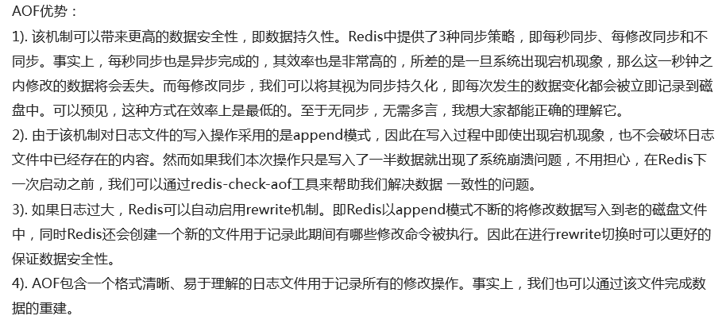
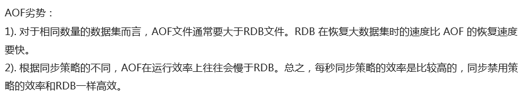
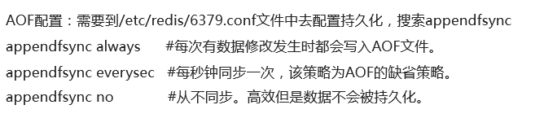
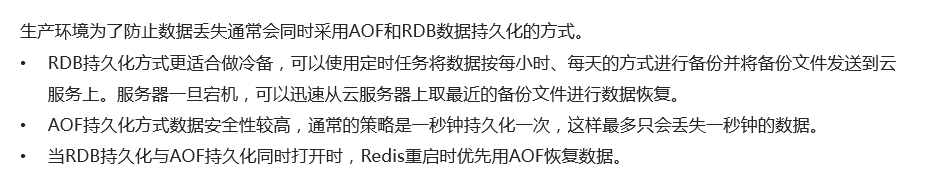

# redis
## redis基础
### 两大作用
* 数据备份
* 提高访问效率

### 数据类型

### 基本操作
* 增/改 set key value
* 删 del key
* 查 get key
* 查所有 Keys *
* 设置过期时间 PEXPIREAT key MILLISECONDS

### redis事务
* 开启事务 MULTI
* 执行操作 操作 + QUEUED
* 提交事务 EXEC
* 回滚事务 DISCARD

### redis 订阅与广播
* 订阅频道 subscribe channel1
* 退订频道 unsubscribe channel1
* 发布消息 publish channel1 'hello world'//返回1表示发布成功，0表示无人订阅
* 查看下服务下所有频道 pubsub channels
* 查看频道下有多个订阅这 pubsub numsub channel1

## redis集群
### 三种集群模式
1从 2哨 3集群
#### 1从：主从模式
* 一主一从
* 优点：支持数据备份
* 缺点：不支持主从节点自动切换及动态扩容

#### 2哨：哨兵模式
* 至少一主一从，setinal节点作为哨兵监控多个master来进行主从切换
* 优点：支持自动主从切换
* 缺点：性能较差，数据分片后不能支持动态扩容，扩容后需要重新刷新数据到redis

#### 3集群：Cluster模式
* 至少3个master，每个master至少1个从节点，在redis集群环境创建16384个slot
* 槽位算法：slot = Hash(key)%16384
* 优点：支持数据备份，主从切换以及数据动态扩容

## redis调优
### 三大问题
#### 1查询慢
* 同类型key值加前缀
* key值尽量短
* 减少key值碎片
* 物理分片

#### 2缓存穿透
* 维护不存在的key
* 利用过滤器

#### 3缓存雪崩
* 加锁维护缓存
* 预先reload缓存
* 过期时间设置均匀
* 做二级缓存或者双缓存策略

## 数据持久化方式
### RDB持久化 
在指定的时间间隔内将内存中的数据集快照写入磁盘，实际操作是fork一个子进程，先将数据集写入临时文件，写入成功后再替代之间的文件，用二进制压缩存储

#### RDB持久化的优劣

#### RDB持久化的配置

### AOF持久化

#### AOF持久化的优劣

#### AOF持久化配置

## 数据恢复

